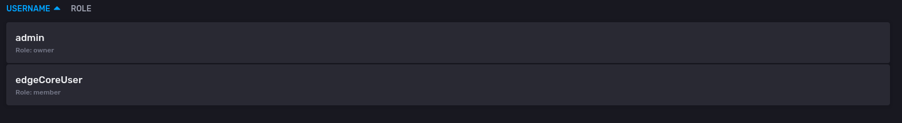

# Initialize and Provision your InfluxDBv2.x Container using Docker Init Containers

Proof-of-Concept of Provisioning your InfluxDBv2.x container through Docker Init Containers using Compose files

InfluxDB has already of provisioning the database by using scripts as volume mounts in the `/docker-entrypoint-initdb.d`
directory. See [Docker Hub Documentation for InfluxDB under section Custom Initialization Scripts][1].

This Repository is a proof-of-concept that once achieve similar initialization via the docker init containers in compose file

## Usage

```bash
docker compose up
```

Should provide you verbose logs that the default initialization user and a custom user are created via the `init-db`
docker init containers.

## Results

- Login into the UI at `http://localhost:8086` using the default admin credentials (see `influxdb.env`)

- Once logged into UI click User Icon on the left-side panel you will observe the provisioned Organization in the `bootstrap-influxdb.sh`
script


- Select the `coreOrg` organization and click on the user icon on left-side panel and click on __Members__, you also see the provisioned
members



## Docker Init Container in Compose

> NOTE: this feature is similar to [Kubernetes Init Containers][1], which is available for
> Docker Compose since version 1.29.

The Init Container can initialize your container by using the `depends_on` spec. Depending on the
intialization process, you can set three conditions of the container's state you wish to initialize:

- `service_started`
- `service_healthy`
- `service_completed_sucessfully`

Unfortunately, this feature is yet to be documented. However, some resources to look into:

1. [Feature Request Issue on Docker Compose ][2]
2. [Pending Pull-Request for Documentation of Init Containers][3]
3. [StackExchange Query with a _possible_ example][4]

## System Specs

Docker Engine version

```bash
Client:
 Version:           20.10.12
 API version:       1.41
 Go version:        go1.17.5
 Git commit:        e91ed5707e
 Built:             Mon Dec 13 22:31:40 2021
 OS/Arch:           linux/amd64
 Context:           default
 Experimental:      true

Server:
 Engine:
  Version:          20.10.12
  API version:      1.41 (minimum version 1.12)
  Go version:       go1.17.5
  Git commit:       459d0dfbbb
  Built:            Mon Dec 13 22:30:43 2021
  OS/Arch:          linux/amd64
  Experimental:     false
 containerd:
  Version:          v1.6.1
  GitCommit:        10f428dac7cec44c864e1b830a4623af27a9fc70.m
 runc:
  Version:          1.1.0
  GitCommit:        v1.1.0-0-g067aaf85
 docker-init:
  Version:          0.19.0
  GitCommit:        de40ad0
```

Docker Compose CLI Version (part of `docker` CLI)

```bash
Docker Compose version 2.3.3
```


[1]: https://hub.docker.com/_/influxdb/
[2]: https://github.com/docker/compose/issues/6855
[3]: https://github.com/docker/docker.github.io/issues/12633
[4]: https://stackoverflow.com/questions/70322031/does-docker-compose-support-init-container